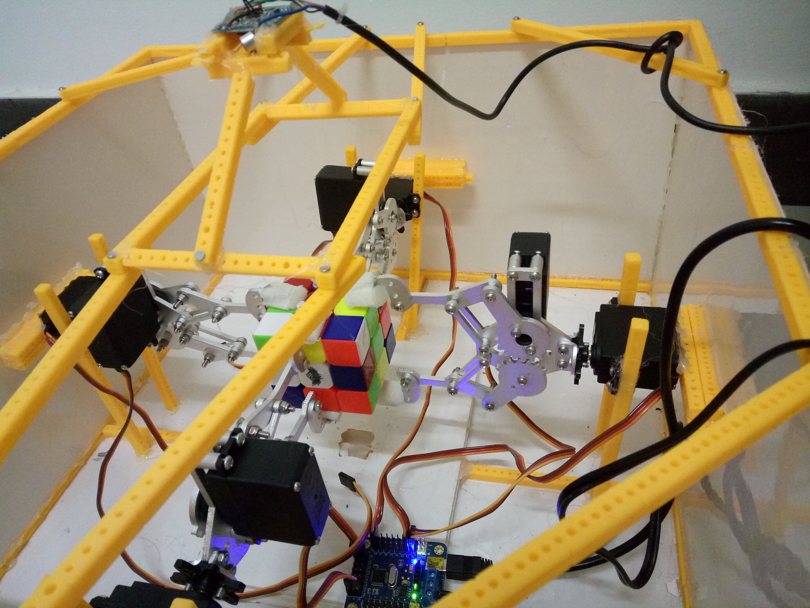

# Cube-Solver

A machine connected to PC that can restore cube automatically. 

Participated in school competition and won the first prize.

The `Old` is the first version of development as a try. As a rapid development, there are many defects and bugs. 

The `new` is the second version and rewritten by VB.NET and has added a new image recognition function that can work with  original function to scan all 6 sides with  only 1 USB-Cam.

The latest program can not be uploaded due to Competition Restrictions.

## To be updated……

